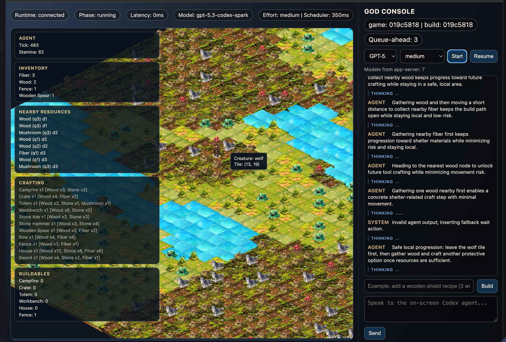

# CodexGame

Self-playing isometric sandbox RPG driven by Codex agents via `codex app-server`.

## Quickstart

### Prerequisites

- Node.js 20+
- `pnpm` 10+
- `codex` CLI available in your `PATH` (or set `CODEX_BIN`)

### Install

```bash
cd /Users/dimillian/Documents/Dev/CodexGame
pnpm install
```

### Run

```bash
pnpm dev
```

This starts:
- Runtime server: `ws://127.0.0.1:8787`
- Web client: `http://127.0.0.1:5173`

### Validate

```bash
pnpm typecheck
pnpm lint
pnpm test
pnpm test:integration
pnpm build
```

## Environment

Runtime env vars:
- `CODEXGAME_RUNTIME_PORT` (default `8787`)
- `CODEX_BIN` (default `codex`)
- `CODEX_CWD` (default repo root)
- `CODEXGAME_CONTENT_DIR` (default `data/content`)
- `CODEXGAME_RUNTIME_DIR` (default `data/runtime`)
- `CODEXGAME_REPLAY_DIR` (default `data/replay`)
- `CODEXGAME_MODEL` (optional model override)
- `CODEXGAME_EFFORT` (optional effort override, default `low`)
- `CODEXGAME_TICK_MS` (default `200`)
- `CODEXGAME_SCHEDULER_MS` (default `350`)
- `CODEXGAME_MAX_QUEUED_ACTIONS` (default `3`, request next turn sooner when queue is low)

Client env vars:
- `VITE_RUNTIME_WS_URL` (default `ws://127.0.0.1:8787`)

UI notes:
- The client now includes a model picker and effort selector before `Start Session`.
- If `Default (runtime)` is selected, runtime falls back to `CODEXGAME_MODEL` / app-server default.

## Workspace

- `apps/game-runtime`: authoritative runtime + Codex bridge + WebSocket API
- `apps/game-client`: React + Phaser UI (God console + isometric map)
- `packages/protocol`: shared transport contracts + Zod schemas
- `packages/simulation`: deterministic world/simulation core
- `data/content`: mutable content files (`prefabs.json`, `recipes.json`, `world_rules.json`)
